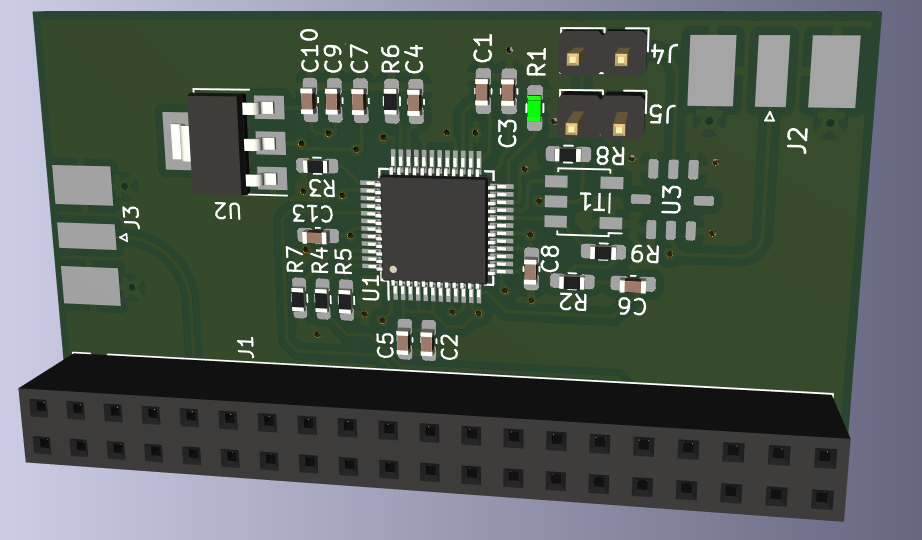

# gr-ad9954_rpi

Daughter board for the Raspberry Pi 3 or 4 fitted with an Analog Devices AD9954 Direct 
Digital Synthesizer.

KiCAD 6 schematic and board are provided.

Mechanical analysis using FreeCAD of the board compatibility with the RPi4:

The Python 3 script ``ad9954.py`` was used to demonstrate proper operation of the board:

 
 
 
